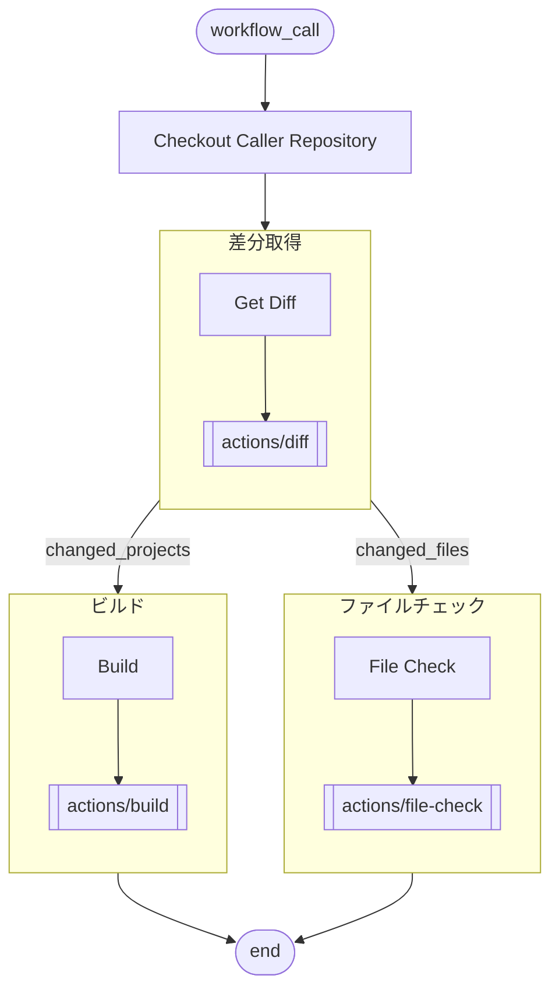

# toko

## 概要
このモジュールは、従来の投稿確認作業に相当する成果物チェックを実行する CI モジュールである。

## フロー


## 環境構築
### GitHub
#### Actions 内で Pull Request を参照できるようにする
Organization と 当リポジトリ それぞれで、以下にチェックを入れる。
```
Settings > Actions > General
Workflow permissions > Allow GitHub Actions to create and approve pull requests
```

### Server
#### csx を実行できるようにする
```cmd
winget install Microsoft.DotNet.SDK.10
dotnet tool install dotnet-script --tool-path [PATH]
```
その後、システム環境変数に ```[PATH]``` を追加する。
