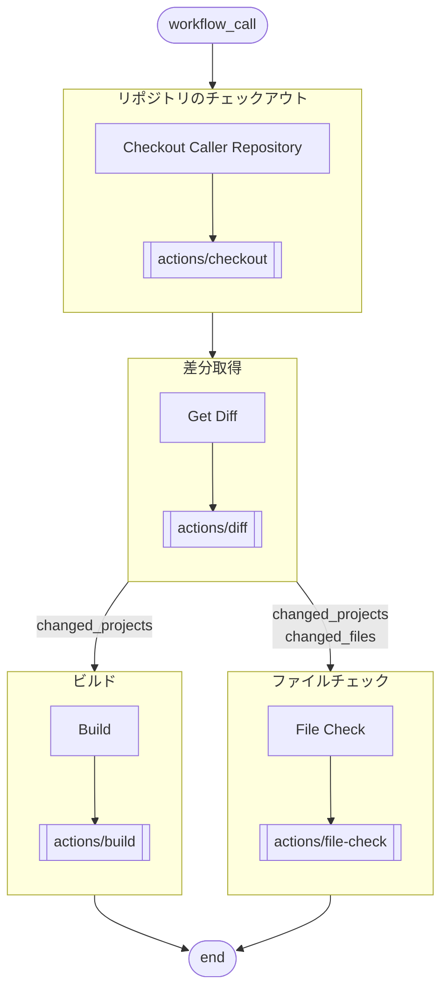

# .github/workflows/toko.yml

## 概要
[.github/workflows/toko.yml](https://github.com/wiseman-fukushi-dev/rv1.actions/blob/main/.github/workflows/toko.yml) は、従来のビルド投稿作業に相当する成果物チェックを実行する CI モジュールです。

## フロー


## 環境構築
### GitHub
#### Actions 内で Pull Request を参照できるようにする
Organization と 当リポジトリ それぞれで、以下にチェックを入れる。
```
Settings > Actions > General
Workflow permissions > Allow GitHub Actions to create and approve pull requests
```

### Server
このモジュールは、self-hosted runner 上で実行される。  
ランナーを登録したサーバーで以下の環境を構築する。
#### PowerShell7(pws) をインストールする
```powershell
winget install --id Microsoft.PowerShell --source winget --installer-type wix
pwsh -v
```

#### dotnet-script(csx) をインストールする
```powershell
winget install Microsoft.DotNet.SDK.10
dotnet --list-sdks

dotnet tool install dotnet-script --tool-path [PATH]
# システム環境変数に ```[PATH]``` を追加
dotnet-script -v
```
